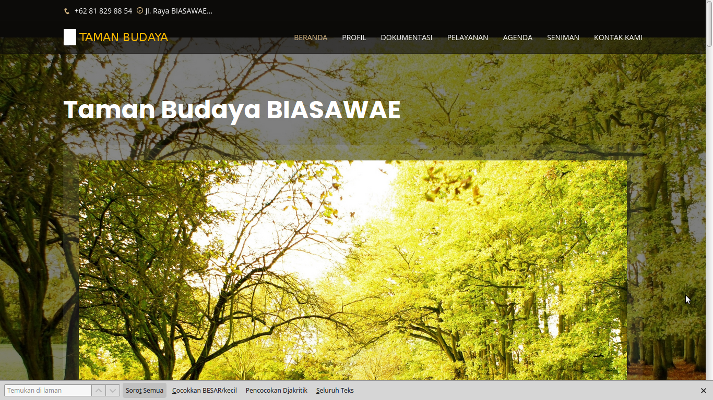
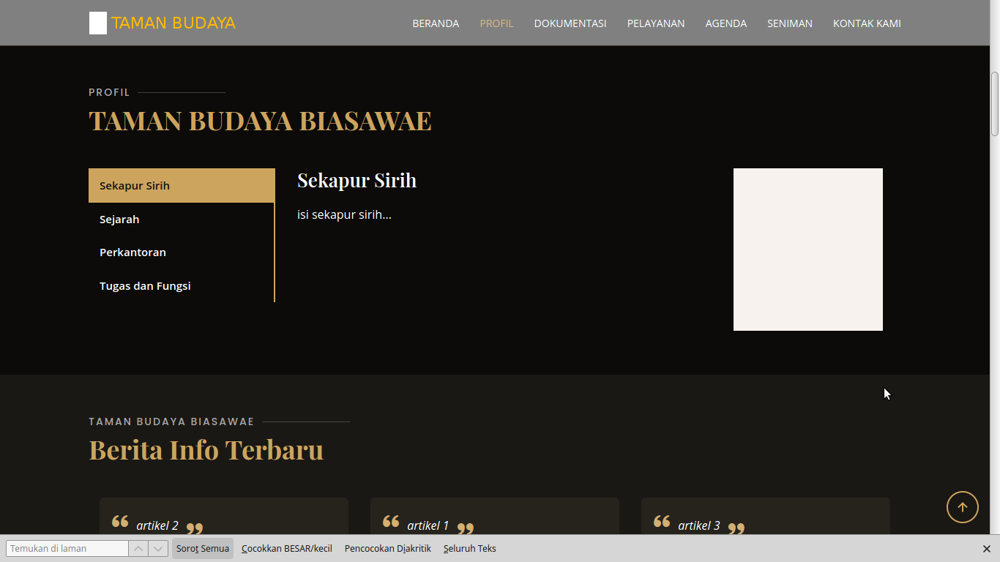
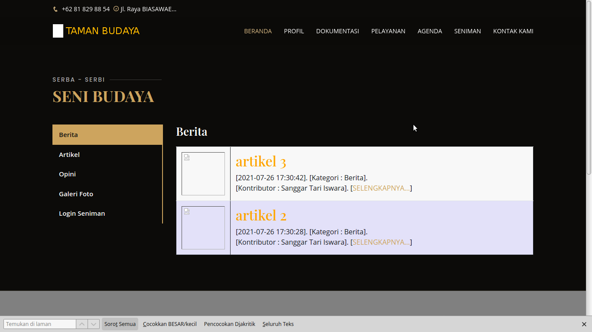
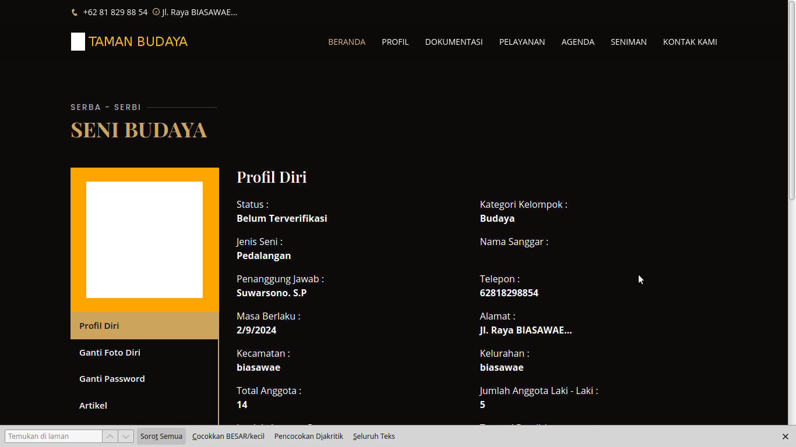
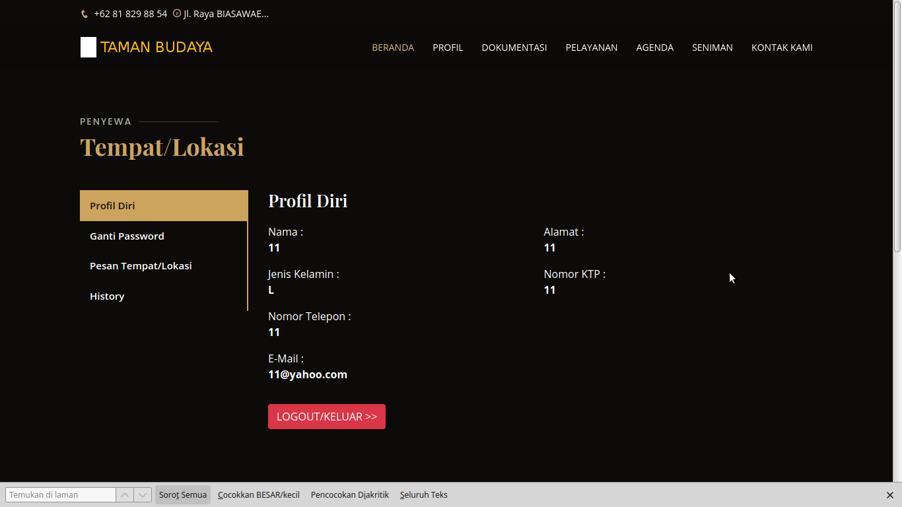
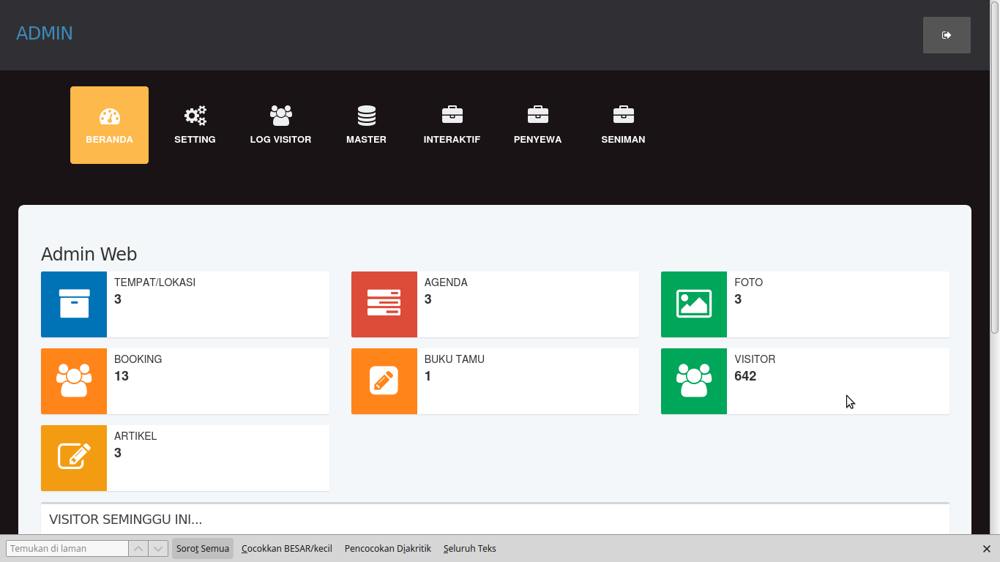

# taman-budaya-biasawae

TAMAN-BUDAYA-BIASAWAE v1.0 

Web Informasi Taman Budaya untuk Kesenian, company profile, akses user seniman, akses user penyewa tempat.

Dibuat dan dites dengan WebServer XAMPP PHP 7.4 . Pada LinuxMint.

---

Dikembangkan oleh : Agus Muhajir                                 
E-Mail : hajirodeon@gmail.com                                    
HP/SMS/WA : 081-829-88-54                                        
source code : http://github.com/hajirodeon                       

---

FITUR :

- Company Profile

- Pesan Sewa Tempat Lokasi

- Data Seniman/Sanggar

- Akses user Penyewa Tempat/Lokasi

- Akses user Seniman

---

TAMPILAN / SKRINSUT :  

 

 

 

 

 

 

---

INSTALASI DAN KONFIGURASI :  

1. Ekstrak file web ke folder web webserver www atau htdocs

2. Untuk konfigurasi, bisa set di file /inc/config.php

3. Jalankan phpmyadmin, buatlah sebuah database. dan lakukan import file database .sql, ada di folder /db

4. Jalankan sesuai alamat web yang ada.

---

http://alamat-web-yg-dibuat/admin

CONTOH AKSES USER ADMIN :

User : admin  

Pass : admin

---

http://alamat-web-yg-dibuat/penyewa.php

CONTOH AKSES USER PENYEWA TEMPAT/LOKASI :

User : 11521

Pass : 11

---

http://alamat-web-yg-dibuat/dok_seni.php

CONTOH AKSES USER SENIMAN :

User : 11

Pass : 11

---

NB. 

DEMO ONLINE atau ingin request custom konten berbayar, silahkan bisa hubungi : 

hp/sms/wa : 081-829-88-54 

atau email : hajirodeon@gmail.com

